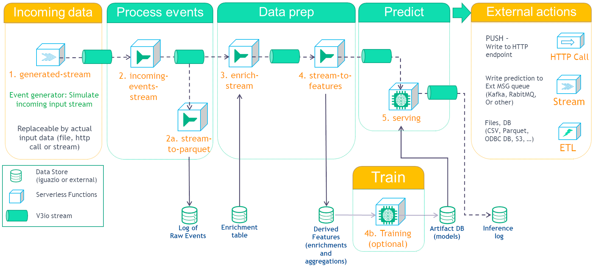

# Model Deployment with Streaming

This demo shows how to deploy a model with streaming information.

The importance of 1st-day churn prediction:
- In some segments of the gaming industry, the average 1st day churn is as high as 70%.
- Acquiring new customers is 5x&ndash;25x more expensive than retaining existing ones.
- Reducing churn by just 5% can boost profitability by 75%.
- Improving retention has a 2x&ndash;4x greater impact on growth than acquisition.
- The probability of selling to an existing customer is 60%&ndash;70%, but only 5%&ndash;20% for a prospect.
- Churn rate also informs metrics like customer lifetime value (LTV).

This demo is comprised of several steps:

While this demo covers the use case of 1st-day churn, it is easy to replace the data, related features and training model and reuse the same workflow for different business cases.

These steps are covered by the following notebooks:

- [**0. Setup**](0-setup.ipynb) - Creates the project and the relevant streams.
- [**1. Event generator**](1-event-generator.ipynb) — Generates events for the training and serving. 
- [**2. incoming event handler**](2-incoming-event-handler.ipynb) - Receive data from the input. This is a common input stream for all the data. This way, one can easily replace the event source data (in this case we have a data generator) without affecting the rest of this flow.
- [**2a. Stream to parquet**](2a-stream-to-parquet.ipynb) - Store all incoming data to parquet files.
- [**3a. Enrichment table**](3a-enrichment-table.ipynb) - Create an enrichment table (lookup values).
- [**3b. Enrich stream**](3b-enrich-stream.ipynb) - Enrich the stream using the enrichment table.
- [**4. Stream to features**](4-stream-to-features.ipynb) - Update aggregation features using the incoming event handler.
- [**5. Serving**](5-serving.ipynb) - Serve the model and process the data from the enriched stream and aggregation features.

This demo comes with a pre-trained model using the base features, enrichment data and derived features, calculated using the same generated data. You can retrain the model or train a new model by opening and running the  [**4b. optional training notebook**](4b-optional-training.ipynb). You will need to ensure enough data is collected via the streams to the data storage in order to train a new model.

## About this demo

### Input Data

The event generator ([1-event-generator.ipynb](1-event-generator.ipynb)) creates the following events: `new_registration`, `new_purchases`, `new_bet` and `new_win` with the following data:

| new_registration |   | new_purchases |   | new_bet    |   | new_win    |
|------------------|---|---------------|---|------------|---|------------|
| user_id          |   | user_id       |   | user_id    |   | user_id    |
| event_type       |   | event_type    |   | event_type |   | event_type |
| event_time       |   | event_time    |   | event_time |   | event_time |
| name             |   | amount        |   | bet_amount |   | win_amount |
| date_of_birth    |   |               |   |            |   |            |
| street_address   |   |               |   |            |   |            |
| city             |   |               |   |            |   |            |
| country          |   |               |   |            |   |            |
| postcode         |   |               |   |            |   |            |
| affiliate_url    |   |               |   |            |   |            |
| campaign         |   |               |   |            |   |            |

Furthermore, `new_registration` includes a `label` column to indicate whether or not the user has churned (1 for churned and 0 for not)

## Enrichment

The enrichment table ([3a-enrichment-table.ipynb](3a-enrichment-table.ipynb)) contains a lookup of postcode and returns a socioeconomic index (`socioeconomic_idx`). The enriched stream contains the original data and the enriched data.

## Feature calculation

During the feature calculation ([4-stream-to-features.ipynb](4-stream-to-features.ipynb)), we calculate sum, mean, count and variance for the 3 amount fields (`amount`, `bet_amount` and `win_amount` for `new_purchases`, `new_bet` and `new_win` respectively). This results with the following list of fields:

- purchase_sum
- purchase_mean
- purchase_count
- purchase_var
- bet_sum
- bet_mean
- bet_count
- bet_var
- win_sum
- win_mean
- win_count
- win_var

